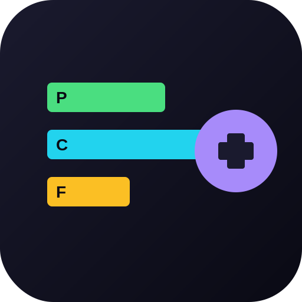
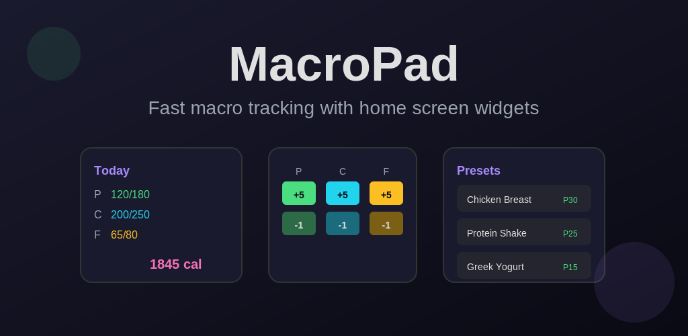
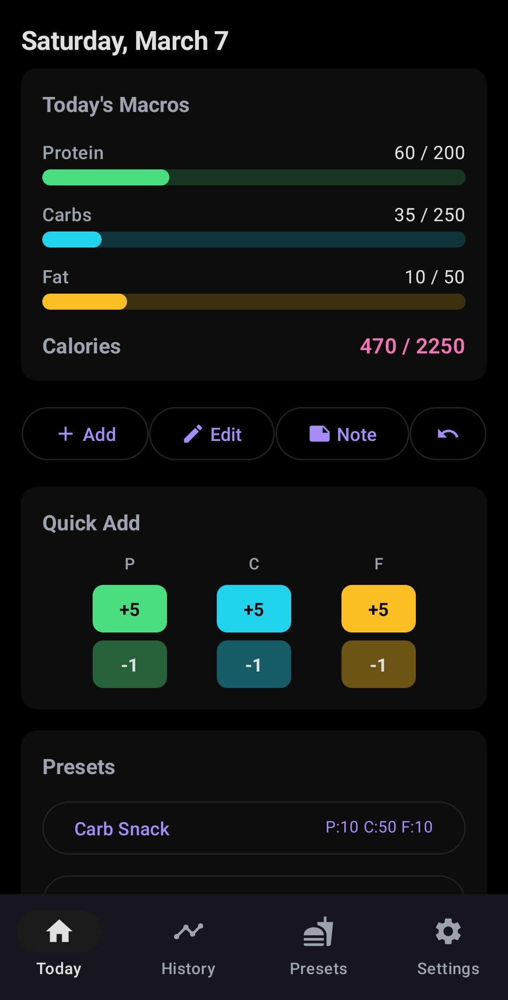
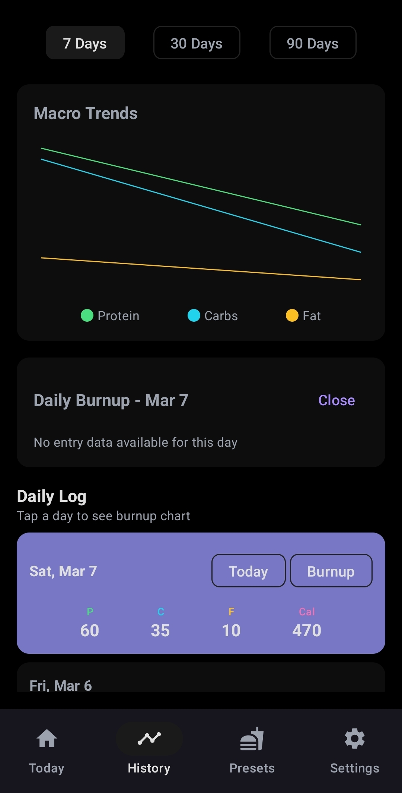
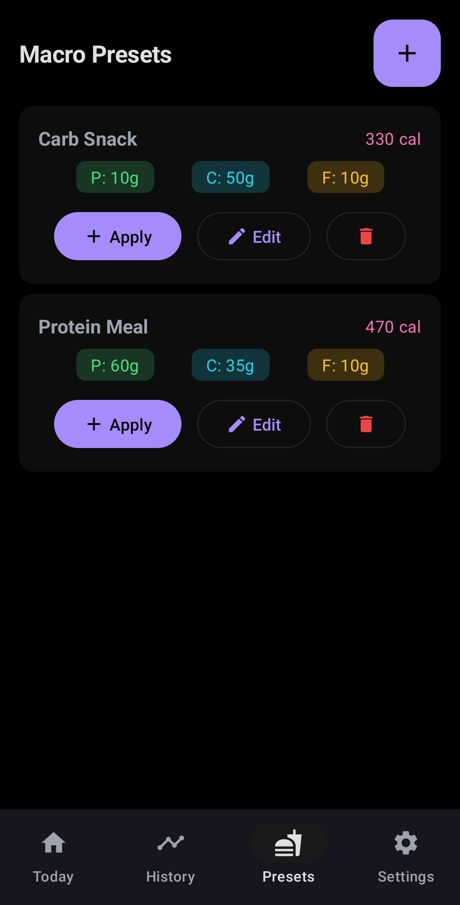
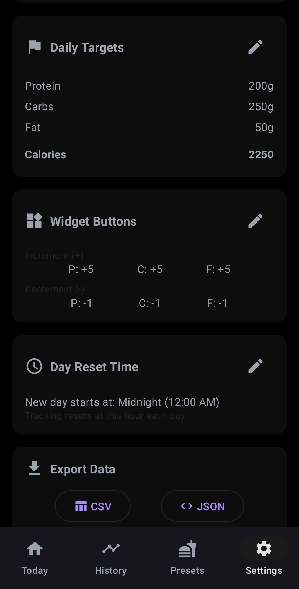

<p align="center">
  
</p>

<h1 align="center">MacroPad - Macro Tracker</h1>

<p align="center">
  Fast, simple macro nutrient tracking for Android with powerful home screen widgets.<br>
  No food databases, no barcode scanning, no subscriptions — just quick macro logging.
</p>

<p align="center">
  <a href="https://play.google.com/store/apps/details?id=com.macropad.app">Google Play</a> · <a href="https://play.google.com/apps/testing/com.macropad.app">Join Beta Testing</a> · <a href="https://kevroy314.github.io/Macro/">Docs</a>
</p>

<p align="center">
  
</p>

## Screenshots

<p align="center">
  
  
  
  
</p>

## Features

- **Home Screen Widgets** — Track macros without opening the app
  - **Status Widget**: Daily totals vs targets at a glance
  - **Increment Widget**: Tap +/- to adjust any macro
  - **Preset Widget**: Apply saved meals with a single tap
- **Presets** — Save go-to meals for one-tap logging
- **Flexible Day Reset** — Set your tracking day to reset at any hour
- **Data Export** — Export as CSV or JSON
- **Dropbox Backup** — Optional cloud sync to your personal Dropbox
- **Privacy First** — All data stored locally, no accounts, no ads, no tracking

## Tech Stack

- Kotlin, Jetpack Compose, Material 3
- Room database with MVVM + Repository pattern
- Glance app widgets
- WorkManager for background Dropbox sync

## Building

Requires Java 17 and Android SDK (compileSdk 35, minSdk 26).

```bash
./MacroPad/build_release.sh
```

## Privacy Policy

https://kevroy314.github.io/Macro/privacy-policy

## License

Open source — see repository for details.
