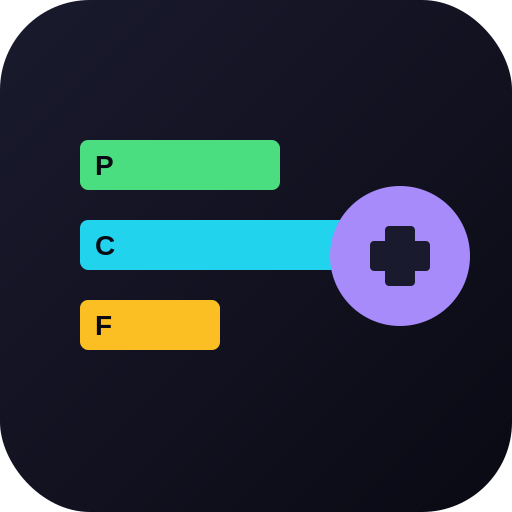
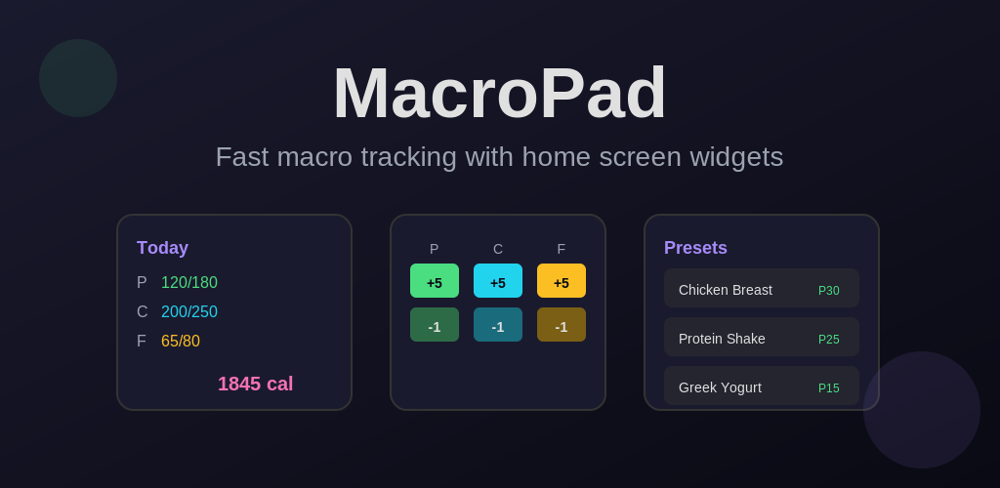

<p align="center">
  
</p>

<h1 align="center">MacroPad - Macro Tracker</h1>

<p align="center">
  Fast, simple macro nutrient tracking for Android with powerful home screen widgets.<br>
  No food databases, no barcode scanning, no subscriptions — just quick macro logging.
</p>

<p align="center">
  <a href="https://play.google.com/store/apps/details?id=com.macropad.app">Google Play</a> · <a href="https://play.google.com/apps/testing/com.macropad.app">Join Beta Testing</a> · <a href="https://kevroy314.github.io/Macro/">Docs</a>
</p>

<p align="center">
  
</p>

## Screenshots

<p align="center">
  
  
  
  
</p>

## Features

- **Home Screen Widgets** — Track macros without opening the app
  - **Status Widget**: Daily totals vs targets at a glance
  - **Increment Widget**: Tap +/- to adjust any macro
  - **Preset Widget**: Apply saved meals with a single tap
- **Presets** — Save go-to meals for one-tap logging
- **Flexible Day Reset** — Set your tracking day to reset at any hour
- **History** — A per-entry timeline of everything logged, with where it came from
- **Data Export** — Export as CSV or JSON
- **Backup** — To your own server, or your personal Dropbox
- **Privacy First** — All data stored locally, no accounts, no ads, no tracking

### Optional, self-hosted

These need a server you run yourself. The app is fully functional without them, and
there is no MacroPad server and no account with us.

- **AI Estimator** — Photograph a meal, a label, a menu or a receipt, and a Claude session
  on *your* machine researches the macros and logs them. Asks a follow-up question only
  when it would meaningfully change the estimate. Jobs photographed away from home send
  themselves when you get back.
- **Planning** — Multi-turn conversations that can see your targets and presets, and can
  log what they suggest
- **Preset search** — Semantic-ish search by meaning, tagged in the background so typing
  stays instant
- **Share with a household** — One server, separate keys, nobody sees anyone else's food
- **In-app updates** — Served from your own machine

See the [setup guide](https://kevroy314.github.io/Macro/self-hosting) — no domain, no
dynamic DNS, no certificate, and no router changes required.

## Tech Stack

- Kotlin, Jetpack Compose, Material 3
- Room database with MVVM + Repository pattern
- Glance app widgets
- WorkManager for background sync
- Optional daemon: FastAPI + SQLite + the Claude Agent SDK, in Docker (`macropad-ai/`)

## Building

Requires Java 17 and Android SDK (compileSdk 35, minSdk 26).

```bash
./MacroPad/build_release.sh
```

## Contributing

See [CONTRIBUTING.md](CONTRIBUTING.md). Features are approved by the maintainer, and
significant ones — anything that notifies you unprompted, changes navigation, or spends
your AI quota on its own — ship behind a Settings flag that starts disabled.

## Privacy Policy

https://kevroy314.github.io/Macro/privacy-policy

## License

Open source — see repository for details.
