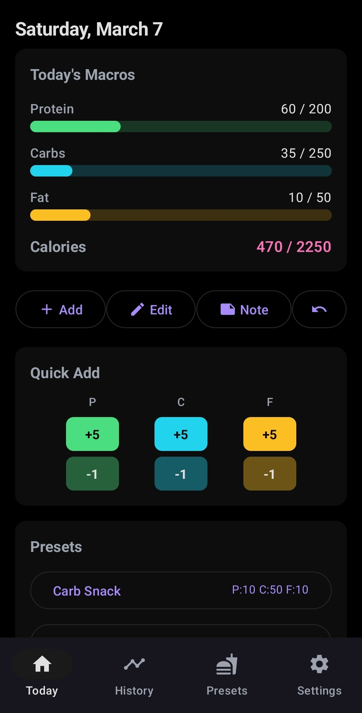
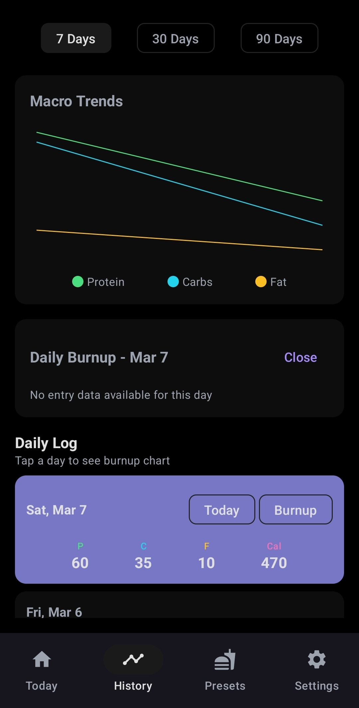
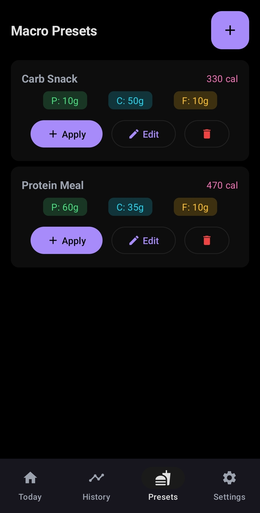
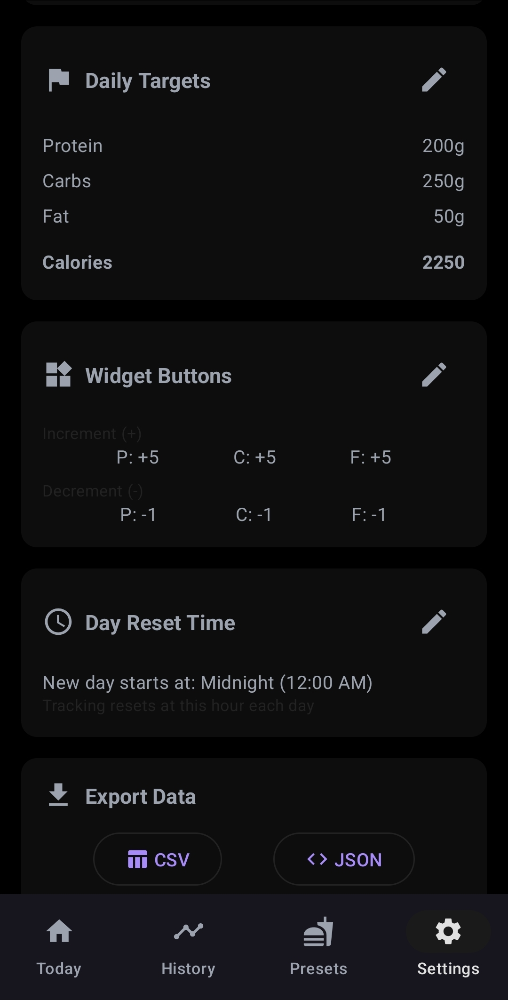

# MacroPad

**Fast macro nutrient tracking with home screen widgets**

[Download Latest Release](https://github.com/kevroy314/Macro/releases/latest) | [Set up the AI Estimator](self-hosting.md) | [Privacy Policy](privacy-policy.md) | [Source Code](https://github.com/kevroy314/Macro)

---

## Features

### Quick Tracking
Add protein, carbs, and fat with just a tap. No complicated food databases or barcode scanning - just simple, fast macro logging.

### Home Screen Widgets
- **Macro Status Widget**: See your daily progress at a glance
- **Increment Widget**: Quick +/- buttons right on your home screen
- **Preset Widget**: Apply saved meals with one tap

### Getting Started
A short walkthrough on first launch — widgets, what's worth logging, and the two
settings that matter. Reachable again any time from Settings.

### Counts Alcohol Properly
Alcohol is 7 calories a gram and is none of protein, carbs or fat, so most trackers let
it vanish. MacroPad counts it as carbs by default, so a couple of drinks still show up.

### Smart Day Reset
Night owl? Set your day to reset at 4am instead of midnight. Your macros follow YOUR schedule.

### Presets
Save your frequently eaten meals and snacks. Apply them instantly without re-entering the same numbers.

### Backup
Back up to your own server, or to your personal Dropbox. Either way the data goes
somewhere you own. Restoring fills in what's missing rather than overwriting days you've
already logged.

### AI Estimator (optional, self-hosted)
For the meals where you don't know the numbers. Photograph the plate, the label, the menu
or the receipt, add a sentence, and a Claude session **running on your own machine**
researches it and logs the result. It asks a follow-up question only when the answer would
move the estimate by more than a threshold you set.

Photograph it at the restaurant and it sends itself when you get home.

There is no MacroPad server and no account with us — you run it, on your hardware, on your
own Claude subscription. [Setup guide](self-hosting.md).

### Planning (optional, self-hosted)
Ask things like *"if I'm having one more protein meal today, how much Goldfish can I have
and stay under my calories?"* It can see your targets, presets and totals, and it can log
what it suggests.

### Export Your Data
Your data is yours. Export anytime as CSV or JSON.

---

## Screenshots

  
  
  
  

---

## Download

**Requires Android 8.0 or higher**

[Download from GitHub Releases](https://github.com/kevroy314/Macro/releases/latest)

---

## Support

Found a bug or have a feature request? [Open an issue on GitHub](https://github.com/kevroy314/Macro/issues)

---

## Legal

- [Privacy Policy](privacy-policy.md)
- [Setting up the AI Estimator](self-hosting.md)
- [Contributing](https://github.com/kevroy314/Macro/blob/main/CONTRIBUTING.md)

MacroPad's source is public, under the
[PolyForm Noncommercial License 1.0.0](https://github.com/kevroy314/Macro/blob/main/LICENSE):
use it, change it, share it, run your own server — for anything noncommercial. Selling
it, or building a paid product on it, needs a separate agreement.
